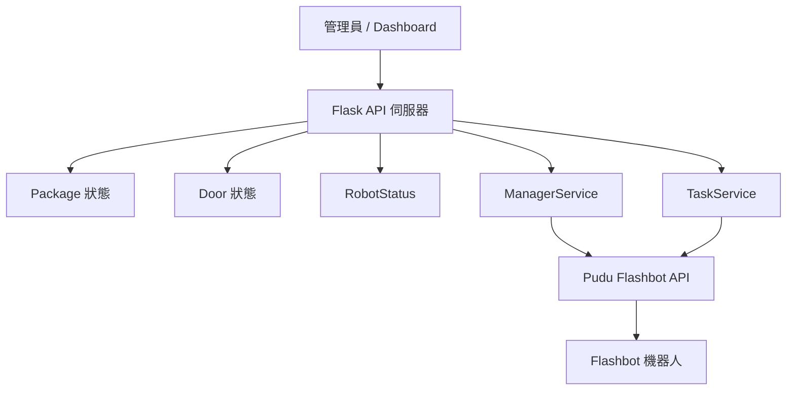
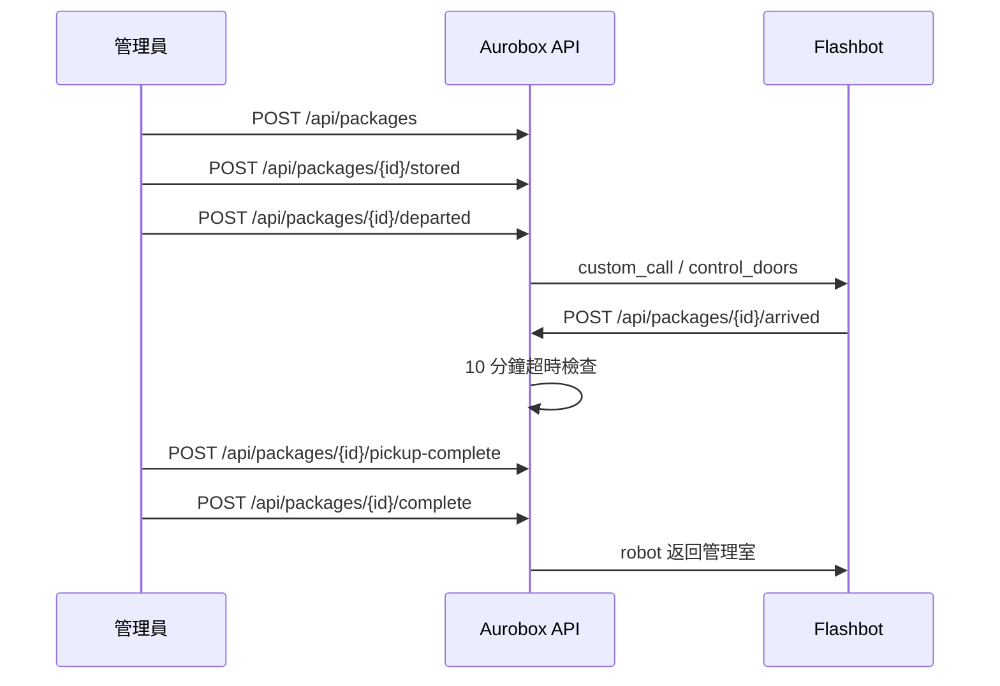

# Aurobox 送貨機器人管理系統

Aurobox 是一套以普渡 Flashbot 為核心的送貨機器人管理系統，提供機器人狀態查詢、艙門控制、包裹配送流程、管理員 Dashboard 與 CLI 工具。

## 功能總覽

- 機器人狀態查詢：`status`、`position`、`recharge`
- 地圖與呼叫控制：`map-list`、`open-map`、`call`
- 包裹生命週期管理：建立、放貨、出發、抵達、取貨完成、退回
- 艙門狀態管理：開啟、關閉、裝載、清空
- Dashboard 即時狀態：機器人、艙門、任務隊列、今日歷史紀錄
- 後台任務：輪詢機器人狀態、超時退回、艙門同步
- CLI 工具：快速查詢與發送控制指令
- Webhook 對接：接收 LINE 平台事件並回寫包裹狀態

## 系統架構



## 主要模組

- `src/aurobox/app.py`: Flask 應用工廠與藍圖註冊
- `src/aurobox/api.py`: 包裹管理與 Dashboard API
- `src/aurobox/manager.py`: 管理員操作流程
- `src/aurobox/tasks.py`: 背景輪詢與超時處理
- `src/aurobox/robot.py`: Flashbot 控制器包裝層
- `src/aurobox/pudu_client.py`: Pudu API 客戶端與簽章
- `src/aurobox/models.py`: SQLAlchemy 模型
- `src/aurobox/cli.py`: CLI 命令列入口

### 狀態整合策略（重要）

- `robot.py` 會同時抓三個來源：
	- V1：`/v1/status/get_by_sn`
	- V2：`/v2/status/get_by_sn`
	- Task：`/v1/robot/task/state/get`
- 對外統一使用 `get_status_summary()` 的正規化結果，不直接用單一來源欄位判斷。
- `state` 的判斷優先順序為：`move_state`（移動/抵達）→ `is_charging`（充電）→ `run_state`（錯誤/忙碌）→ 其餘視為 `Idle`。

## 安裝與啟動

### 1. 建立虛擬環境

```bash
python3 -m venv .venv
```

Windows：

```bash
.venv\Scripts\activate
```

Linux / macOS：

```bash
source .venv/bin/activate
```

### 2. 安裝套件

```bash
python -m pip install -e .
```

### 3. 建立環境變數

```bash
cp .env.example .env
```

請至少設定以下值：

```env
Pd_key=YOUR_PUDU_API_KEY
Pd_secret=YOUR_PUDU_API_SECRET
Aurotek_id=YOUR_SHOP_ID
FLASHBOT_SN=8FF055923050007
PUDU_BASE_URL=https://css-open-platform.pudutech.com
```

若要啟用訊息通知整合，另外設定：

```env
LINE_CHANNEL_ACCESS_TOKEN=YOUR_LINE_CHANNEL_ACCESS_TOKEN
LINE_CHANNEL_SECRET=YOUR_LINE_CHANNEL_SECRET
```

### 4. 啟動服務

```bash
python run.py --debug
```

預設啟動於 `http://127.0.0.1:5000`

## API 端點

### 包裹管理

| 方法 | 端點 | 說明 |
|---|---|---|
| POST | `/api/packages` | 建立新包裹 |
| GET | `/api/packages/<package_id>` | 取得包裹詳情 |
| POST | `/api/packages/<package_id>/response` | 住戶選擇 `pickup_now` / `later` |
| POST | `/api/packages/<package_id>/stored` | 管理員放貨並指定艙門 |
| POST | `/api/packages/<package_id>/departed` | 確認機器人出發 |
| POST | `/api/packages/<package_id>/arrived` | 記錄機器人抵達 |
| POST | `/api/packages/<package_id>/pickup-complete` | 掃碼後完成取貨 |
| POST | `/api/packages/<package_id>/complete` | 住戶確認完成 |
| POST | `/api/packages/<package_id>/cancel` | 取消或逾時退回 |
| POST | `/api/packages/<package_id>/returned` | 記錄機器人返回 |

### Dashboard

| 方法 | 端點 | 說明 |
|---|---|---|
| GET | `/api/dashboard/events` | 取得即時狀態、任務隊列、艙門與今日歷史紀錄 |

### Webhook（對外對接入口）

| 方法 | 端點 | 說明 |
|---|---|---|
| POST | `/webhooks/line` | LINE Messaging API webhook 入口，接收 postback / message 事件 |


補充：

- `GET /`：本機服務資訊首頁
- `GET /healthz`：健康檢查

### 回傳資料重點

`GET /api/dashboard/events` 會回傳：

- `robot_status`: `state`、`battery_level`、`current_location`、`move_state`、`run_state`、`task_state`、`is_charging`、`charge_stage`
- `task_queue`: 待處理、進行中、稍後處理、歷史紀錄數量
- `door_states`: 每個艙門的狀態與對應包裹
- `pending_orders`、`delivering_orders`: 目前進行中的訂單清單

備註：當上游 Pudu API 授權失敗時，`/api/dashboard/events` 會回傳對應上游錯誤狀態碼（例如 401），不再一律回傳 500。

## CLI 指令

```bash
aurobox status --sn 8FF055923050007
aurobox position --sn 8FF055923050007
aurobox recharge --sn 8FF055923050007
aurobox map-list --sn 8FF055923050007
aurobox door-state --sn 8FF055923050007
aurobox open-map --map-name map1 --shop-id YOUR_SHOP_ID
aurobox call --map-name map1 --point management --sn 8FF055923050007
```

## 資料模型

- `Package`: 包裹配送記錄，含狀態、艙門、時間戳記
- `Door`: 艙門狀態，含開關與裝載狀態
- `RobotStatus`: 機器人即時狀態
- `DeliveryHistory`: 操作歷史紀錄

## 包裹流程



## 背景任務

- `poll_robot_status(sn)`: 週期性輪詢機器人狀態並更新資料庫
- `check_pickup_timeout(timeout_minutes=10)`: 檢查超時未取貨訂單
- `sync_door_states(sn)`: 同步艙門狀態
- `handle_robot_returning(sn)`: 機器人返回後的清理流程

## 故障排查

### 機器人狀態查詢失敗

- 檢查 `Pd_key` 與 `Pd_secret`
- 確認 `FLASHBOT_SN` 正確
- 確認網路可以連到 Pudu API

### Dashboard 沒有資料

- 確認資料庫已建立：`instance/aurobox.db`
- 確認 Flask 應用已正常啟動
- 檢查 `ROBOT_SN` 是否和實際機器人一致

### 包裹流程異常

- 檢查包裹狀態是否與艙門狀態一致
- 使用 `force_reset_all_doors()` 做防呆檢查
- 查看 `delivery_history` 是否有記錄

## 專案結構

```text
src/aurobox/
├── __init__.py
├── app.py
├── api.py
├── cli.py
├── config.py
├── manager.py
├── models.py
├── pudu_client.py
├── robot.py
├── tasks.py
└── webhooks.py
```

其他重要檔案：

- `run.py`: Flask 啟動入口
- `examples.py`: 使用範例
- `REPORT.md`: 實作完成報告

## 技術棧

- Flask 3.0+
- SQLAlchemy + SQLite
- requests
- python-dotenv
- Pudu Flashbot API

## 授權

MIT License
