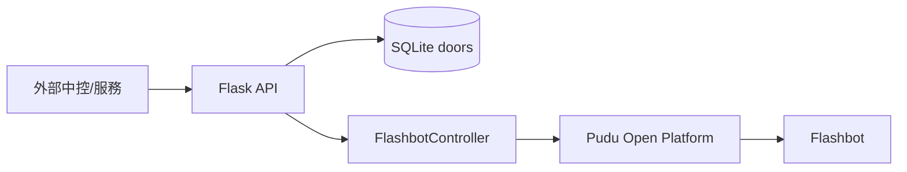

# Aurobox Flashbot Hardware API

Aurobox 目前已收斂為「機器人硬體控制 + 對外 API」專案。

此版本不再內建完整的包裹資料流程、Dashboard 前端或 LINE webhook；這些已轉由外部系統處理。
本專案專注提供可被外部中控呼叫的機器人控制介面，以及本地艙門狀態管理。

## 目前定位

- 控制 Pudu Flashbot 的移動、地圖與艙門。
- 提供給外部中控系統呼叫的 HTTP API。
- 維護最小本地狀態：`doors` 資料表。
- 回傳機器人即時狀態，供外部 Dashboard 或服務整合。

## 功能現況

- 已保留：
  - Flask API 服務與健康檢查
  - Pudu API client（簽章、GET/POST）
  - 機器人狀態整合（V1/V2/task-state）
  - 艙門開關控制
  - 包裹對應艙門的最小流程 API（load/complete/returned）
  - CLI 快速操作工具
- 已移出或不在目前程式碼中：
  - 內建 Dashboard 前端
  - LINE webhook 與推播流程
  - 完整包裹資料模型（如 Package、DeliveryHistory 等）
  - 背景排程任務（timeout/polling queue）

## 架構



## 專案結構

```text
src/aurobox/
├── __init__.py
├── app.py
├── api.py
├── cli.py
├── config.py
├── models.py
├── pudu_client.py
└── robot.py

run.py
pyproject.toml
tests/test_pudu_client.py
```

## 環境需求

- Python 3.10+
- Flask 3.0+
- Flask-SQLAlchemy 3.0+
- requests 2.31+
- python-dotenv 1.0+

## 快速啟動

1. 建立並啟用虛擬環境

```bash
python3 -m venv .venv
source .venv/bin/activate
```

Windows PowerShell:

```powershell
.venv\Scripts\Activate.ps1
```

2. 安裝套件

```bash
python -m pip install -e .
```

3. 建立 `.env`

```bash
cp .env.example .env
```

最少需要：

```env
Pd_key=YOUR_PUDU_API_KEY
Pd_secret=YOUR_PUDU_API_SECRET
Aurotek_id=YOUR_SHOP_ID
FLASHBOT_SN=8FF055923050007
DEFAULT_MAP_NAME=YOUR_MAP_NAME
HOME_POINT_NAME=閃閃充電
```

4. 啟動 API

```bash
python run.py --debug
```

預設位址：`http://0.0.0.0:5000`

## API 一覽

基礎：

- `GET /`
- `GET /healthz`

硬體控制與流程：

- `POST /api/doors/<door_number>/load`
  - 將指定 `package_id` 標記到本地艙門狀態（`full`）。
- `POST /api/robot/dispatch`
  - 指示機器人前往指定點位（由外部傳入 `point`；相容舊欄位 `unit`）。
- `POST /api/packages/<package_id>/show-qr`
  - 命令機器人顯示 QR 畫面（`call_mode=QR_CODE`）。
- `POST /api/packages/<package_id>/cancel`
  - 中斷當前任務顯示、關門，並保留包裹於艙門（`full`）。
- `POST /api/packages/<package_id>/pickup-complete`
  - 驗證在外部完成後，開啟對應艙門。
- `POST /api/packages/<package_id>/complete`
  - 關門並釋放艙門（`empty`），若全空則自動返航。
- `POST /api/packages/<package_id>/returned`
  - 管理員取出退回包裹後釋放艙門（`empty`）。
- `GET /api/dashboard/status`
  - 回傳機器人即時狀態摘要 + 本地艙門狀態。

## CLI

```bash
aurobox --sn 8FF055923050007 status
aurobox --sn 8FF055923050007 position
aurobox --sn 8FF055923050007 recharge
aurobox --sn 8FF055923050007 map-list
aurobox --sn 8FF055923050007 door-state
aurobox --map-name map1 --shop-id YOUR_SHOP_ID open-map
aurobox --map-name map1 --point management --sn 8FF055923050007 call
```

## 狀態整合邏輯

`FlashbotController.get_status_summary()` 會整合：

- `/v1/status/get_by_sn`
- `/v2/status/get_by_sn`
- `/v1/robot/task/state/get`

並回傳統一欄位：`state`、`move_state`、`run_state`、`task_state`、`battery_level`、`current_location`。

## 測試

```bash
pytest -q
```

目前測試以設定載入與 client/controller 初始化為主。

## 版本資訊

- 目前版本：`0.2.0`
- 歷史報告：`REPORT.md`（0.1.0）
- 本次整理報告：`REPORT_2.md`（0.2.0）
