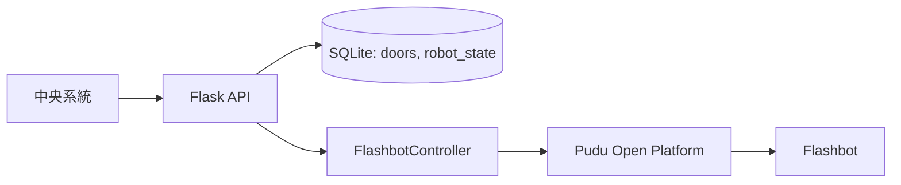

# Aurobox Flashbot Hardware API

Aurobox 是一個聚焦在 Pudu Flashbot 的硬體控制層，提供對外 HTTP API 讓中央系統可進行派車、艙門控制與狀態查詢。

目前版本重點是「最小本地狀態 + 外部中控整合」，不包含完整住戶互動流程、前端 Dashboard 或 LINE webhook。

## 目前定位

- 控制 Flashbot 移動、地圖呼叫與艙門開關。
- 對外提供可整合的 Flask API。
- 本地僅保存最小必要資料：`doors` 與 `robot_state`。
- 整合 Pudu 多來源狀態並輸出統一摘要。

## 系統架構



## 專案結構

```text
src/aurobox/
├── api.py           # 對外路由
├── app.py           # Flask app factory
├── cli.py           # CLI 指令
├── config.py        # .env 設定載入
├── models.py        # Door / RobotState
├── pudu_client.py   # Pudu API client + 簽章
├── robot.py         # FlashbotController
├── services.py      # DB / 返航邏輯
├── tasks.py         # 背景輪詢與通知
└── utils.py         # payload 組裝工具

scripts/
├── check_db.py
└── read_maps_and_position.py

tests/
└── test_pudu_client.py

run.py
pyproject.toml
REPORT.md
```

## 環境需求

- Python 3.10+
- requests >= 2.31.0
- python-dotenv >= 1.0.0
- flask >= 3.0.0
- flask-sqlalchemy >= 3.0.0
- python-dateutil >= 2.8.0
- cryptography >= 41.0.0

## 快速啟動

1. 建立虛擬環境

```bash
python3 -m venv .venv
source .venv/bin/activate
```

Windows PowerShell:

```powershell
.venv\Scripts\Activate.ps1
```

2. 安裝套件

```bash
python -m pip install -e .
```

3. 建立 `.env`

```env
Pd_key=YOUR_PUDU_API_KEY
Pd_secret=YOUR_PUDU_API_SECRET
Aurotek_id=YOUR_SHOP_ID
FLASHBOT_SN=8FF055923050007
DEFAULT_MAP_NAME=YOUR_MAP_NAME
HOME_POINT_NAME=閃閃充電
CENTRAL_API_BASE_URL=https://your-central-api.example.com
```

4. 啟動服務

```bash
python run.py --debug
```

預設監聽：`http://0.0.0.0:5000`

## API 一覽（依目前程式）

基礎：

- `GET /`
- `GET /healthz`

硬體流程：

- `POST /api/doors/assign`
  - 參數：`{ "id": "<package_id>" }`
  - 行為：找空艙門、呼叫機器人回管理室、背景輪詢抵達後開門。
- `POST /api/doors/load`
  - 參數：`{ "id": "<package_id>" }`
  - 行為：關門，狀態從 `assigned` 轉 `full`。
- `POST /api/robot/dispatch`
  - 參數：`point`（或相容舊欄位 `unit`）、可選 `map_name`、`point_type`、`package_id`。
  - 行為：派遣機器人到指定點位，若有 `package_id` 會背景輪詢並通知中央系統抵達。
- `POST /api/packages/<package_id>/pickup-complete`
  - 行為：關閉任務畫面（若有 task_id）並開啟對應艙門。
- `POST /api/packages/<package_id>/complete`
  - 行為：關門並釋放艙門；若所有艙門皆空，觸發返航。
- `POST /api/packages/<package_id>/cancel`
  - 行為：關門、關閉任務畫面，包裹仍保留在艙門內（維持 `full`）。
- `POST /api/packages/return`
  - 行為：退回包裹後釋放艙門。
- `POST /api/doors/return-complete`
  - 行為：拿出被退回的包裹後關閉艙門。
- `GET /api/dashboard/status`
  - 行為：回傳機器人即時狀態摘要與本地艙門狀態。

## CLI

```bash
aurobox --sn 8FF055923050007 status
aurobox --sn 8FF055923050007 position
aurobox --sn 8FF055923050007 recharge
aurobox --sn 8FF055923050007 map-list
aurobox --sn 8FF055923050007 door-state
aurobox --shop-id YOUR_SHOP_ID open-map --map-name map1
aurobox --sn 8FF055923050007 --shop-id YOUR_SHOP_ID call --map-name map1 --point 管理室
```

## 狀態整合策略

`FlashbotController.get_status_summary()` 會合併：

- `/pudu-entry/open-platform-service/v1/status/get_by_sn`
- `/pudu-entry/open-platform-service/v2/status/get_by_sn`
- `/pudu-entry/open-platform-service/v1/robot/task/state/get`

並輸出統一欄位如 `state`、`move_state`、`run_state`、`task_state`、`battery_level`、`current_location`。

## 已知問題（2026-07-14）

- `examples.py` 仍引用舊版 `manager.py` 與歷史資料模型，與目前 0.2.0 架構不一致。

## 測試

```bash
pytest -q
```

目前測試以設定與初始化為主（`tests/test_pudu_client.py`）。

## 版本資訊

- 套件版本：`0.2.0`
- 本次盤點報告：`REPORT.md`
