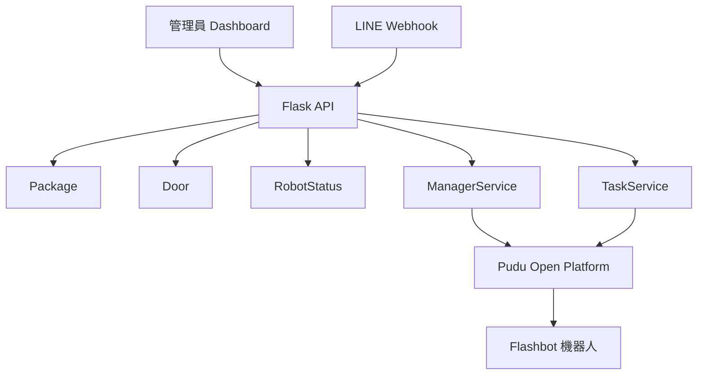

# Aurobox 實作完成報告

**完成日期**: 2026-07-08
**版本**: 0.1.0
**狀態**: 核心流程已完成，可進行端到端驗證

## 1. 專案概述

Aurobox 是一套以普渡 Flashbot 為核心的送貨機器人管理系統，涵蓋包裹派送、艙門控制、機器人狀態監控、LINE webhook、Dashboard 與 CLI 操作。

## 2. 已完成項目

### 2.1 Flask + SQLAlchemy 基礎架構

- [x] Flask 應用工廠與 Blueprint 註冊
- [x] SQLAlchemy 資料庫初始化
- [x] SQLite 舊資料表補欄機制
- [x] 環境變數載入與配置整合

### 2.2 資料模型

- [x] `Package`
   - 包裹狀態流程：`pending`、`later`、`pickup_now`、`delivering`、`arrived`、`completed`、`returned_cancelled`、`returned_timeout`
   - 包含艙門、時間戳記、LINE 使用者 ID、取貨 QR token
- [x] `Door`
   - 艙門狀態、裝載狀態、包裹對應資訊
- [x] `RobotStatus`
   - `move_state`、`run_state`、`task_state`、`is_charging`、`charge_stage` 等即時欄位
- [x] `DeliveryHistory`
   - 完整操作歷史與 JSON details

### 2.3 包裹管理 API

| 方法 | 端點 | 說明 |
|---|---|---|
| POST | `/api/packages` | 建立新包裹 |
| GET | `/api/packages/<id>` | 取得包裹詳情 |
| POST | `/api/packages/<id>/response` | 住戶選擇 `pickup_now` / `later` |
| POST | `/api/packages/<id>/stored` | 管理員放貨並指定艙門 |
| POST | `/api/packages/<id>/departed` | 確認機器人出發 |
| POST | `/api/packages/<id>/arrived` | 機器人抵達、建立 QR token、嘗試顯示 QR |
| POST | `/api/packages/<id>/pickup-complete` | 掃碼後完成取貨，驗證 token |
| POST | `/api/packages/<id>/complete` | 取貨完成後清空艙門 |
| POST | `/api/packages/<id>/cancel` | 取消或逾時退回 |
| POST | `/api/packages/<id>/returned` | 記錄機器人返回 |

### 2.4 Dashboard 即時狀態 API

- 端點：`GET /api/dashboard/events`
- 回傳：機器人狀態、任務隊列、艙門狀態、今日歷史資料
- 來源整合：V1 / V2 / task-state 三個 Pudu 狀態來源
- 上游授權或 HTTP 錯誤會回傳對應狀態碼，不再全部包成 500

### 2.5 LINE Webhook

- 端點：`POST /webhooks/line`
- 驗證 `X-Line-Signature`
- 支援 `postback` 與 `message`
- 可用於包裹狀態回寫與訊息推播

### 2.6 QR Code 取貨流程

- 機器人抵達時建立 `pickup_qr_token`
- 系統會嘗試呼叫 Pudu `call_mode=QR_CODE` 顯示取貨 QR
- `pickup-complete` 需帶入相同 token 才會成功
- 目前沒有另外提供 QR 圖片產生器，前端或 LINE 端可自行將 token 轉成 QR 圖片

### 2.7 custom_call 與呼叫模式

- `custom_call` 預設 `call_mode` 已調整為 `CALL`
- 只有 QR 取貨流程才明確使用 `QR_CODE`
- `IMG` 保留作為圖片展示模式，不作為預設值

### 2.8 管理員服務與背景任務

- [x] `register_package()`
- [x] `allocate_door()`
- [x] `call_robot_to_management()`
- [x] `confirm_door_open()`
- [x] `confirm_package_loaded()`
- [x] `force_reset_all_doors()`
- [x] `correct_door_state()`
- [x] `get_task_queue()`
- [x] `poll_robot_status()`
- [x] `check_pickup_timeout()`
- [x] `sync_door_states()`
- [x] `handle_robot_returning()`

### 2.9 CLI 與啟動

- [x] `aurobox status`
- [x] `aurobox position`
- [x] `aurobox recharge`
- [x] `aurobox map-list`
- [x] `aurobox door-state`
- [x] `aurobox open-map`
- [x] `aurobox call`
- [x] Flask 開發伺服器與 debug 模式啟動

## 3. 目前資料流

## 4. 主要流程

### 4.1 派送流程

1. 管理員建立包裹。
2. 住戶選擇 `pickup_now` 或 `later`。
3. 管理員放貨並指定艙門。
4. 機器人前往住戶地址。
5. 機器人抵達後生成 `pickup_qr_token`，並嘗試以 `QR_CODE` 顯示取貨 QR。
6. 住戶掃碼後呼叫 `pickup-complete` 完成取貨。
7. 系統清空艙門並記錄完成歷史。

### 4.2 逾時退回

- 由 `check_pickup_timeout()` 檢查逾時未取貨訂單。
- 逾時後狀態會轉為 `returned_timeout`，並觸發返航或退回流程。

## 5. 重要說明

### 5.1 狀態整合

- `get_status_summary()` 是 Dashboard 與背景任務的主要狀態入口。
- 不再直接依賴單一 `run_state` 判斷機器人動作。

### 5.2 QR 與 webhook

- LINE webhook 是對外事件入口，不是前端輪詢 API。
- QR 取貨目前採 token 驗證流程，機器人端顯示 QR 屬於 `QR_CODE` 呼叫模式。

### 5.3 custom_call

- 預設模式是 `CALL`。
- 若需要圖片、影片、QR 顯示，需顯式指定 `call_mode`。

## 6. 環境需求

- Python 3.10+
- Flask 3.0+
- SQLAlchemy 3.0+
- requests 2.31+
- python-dotenv 1.0+
- cryptography 41+

## 7. 文件與入口

- [README.md](./README.md): 使用與 API 說明
- `run.py`: 應用啟動入口
- `examples.py`: 範例腳本

## 8. 後續可延伸項目

- 前端 QR 圖片直接顯示
- LINE Flex / LIFF 取貨頁
- 多機器人支援
- 異步任務隊列與重試機制

